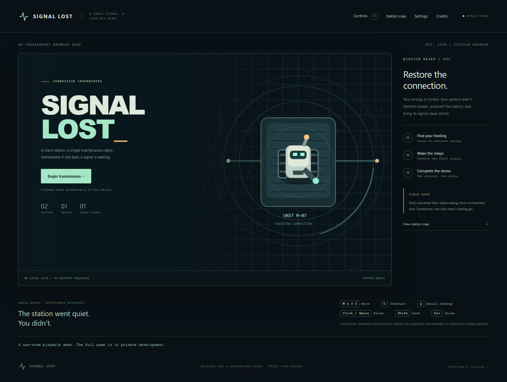
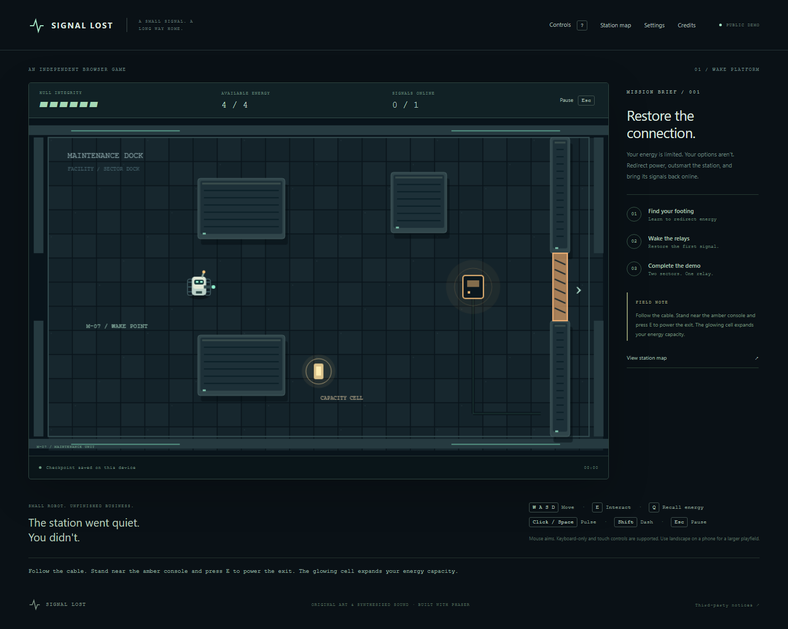

# Signal Lost — playable portfolio demo

A two-room action-puzzle browser game built with TypeScript, Phaser 3 and Vite. Move a maintenance robot through an abandoned station, redirect energy to open a door and activate a bridge, then restore the first relay.

This public repository contains the **compiled demo**, its case study, screenshots and smoke tests. The complete six-room source project is private for further commercial development. The other four levels are excluded at build time; there is no hidden full-game unlock here. Browser JavaScript remains inspectable.

## Play

Open the [live demo](https://signal-lost-demo.vercel.app). No account or download is needed. WASD/arrows move, E interacts, Q recalls energy, Space/click fires and Shift dashes. Use the visible buttons on touchscreens. Settings include sound, reduced motion and assist mode. Saves stay in this browser.

## Engineering

The private implementation separates pure simulation, input, rendering, scene lifecycle, audio and semantic HTML menus. Local saves are validated, malformed data recovers safely, and unavailable storage is reported. A build-time campaign alias selects the demo. A bundle check rejects private level identifiers and source maps.

The source project has 27 unit/campaign checks and desktop/mobile browser coverage. See [case study](PORTFOLIO_CASE_STUDY.md) and the public CI smoke tests. Created with AI coding assistance and iteratively tested; this is a project sample rather than a claim of unaided authorship.

## Local preview and testing

Serve this directory with any static HTTP server. For example, with Python installed: `python -m http.server 5182 --bind 127.0.0.1`. Open http://127.0.0.1:5182.

`pnpm install --frozen-lockfile`, `pnpm exec playwright install chromium`, then `pnpm test` run the demo smoke tests against a local static server. Set PUBLIC_BASE_URL to test a hosted deployment.

## Distribution and limits

Original material is reserved for the owner. Playing this demo does not grant commercial reuse rights. Dependency MIT notices remain bundled. The private game is not a Steam release; commercial/store work continues separately. Automated mobile tests use emulation, not physical-device certification.

[All six portfolio projects](PORTFOLIO_INDEX.md) · [CI tests](https://github.com/alexdina712-dev/signal-lost-demo/actions)
